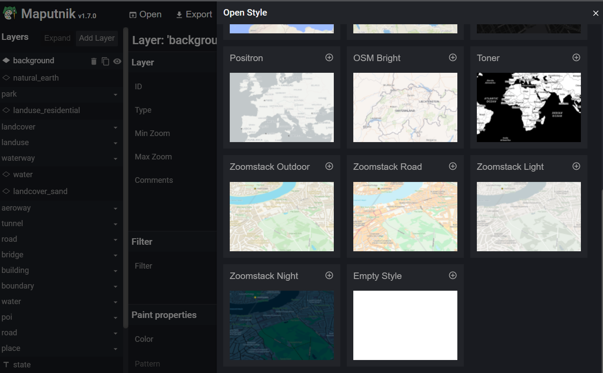
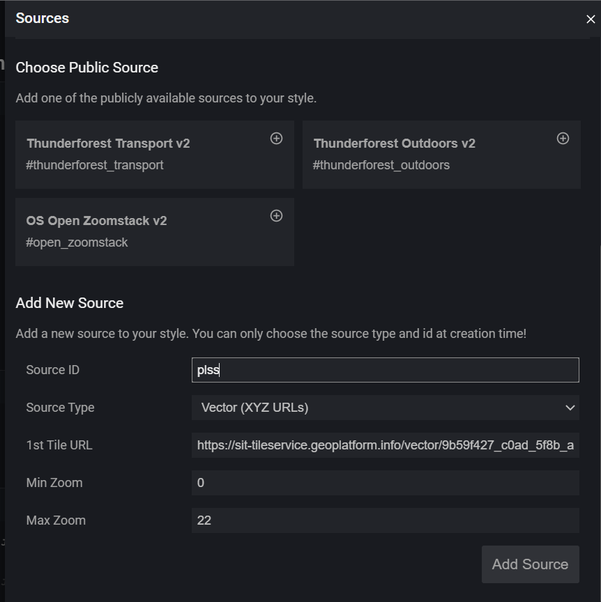
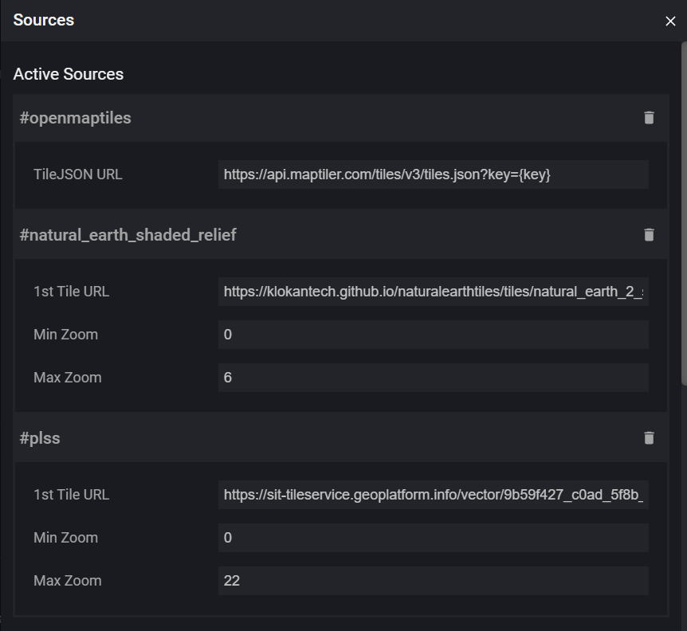
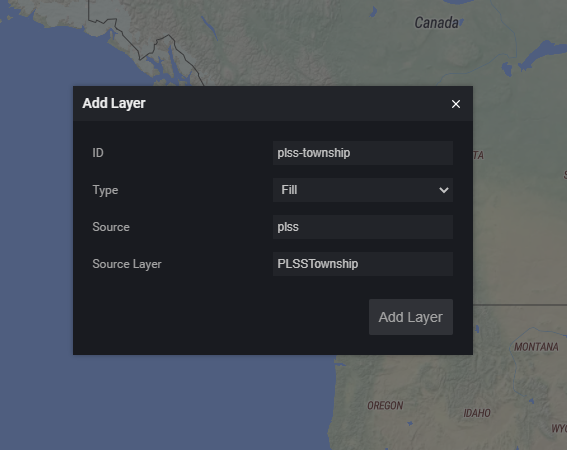
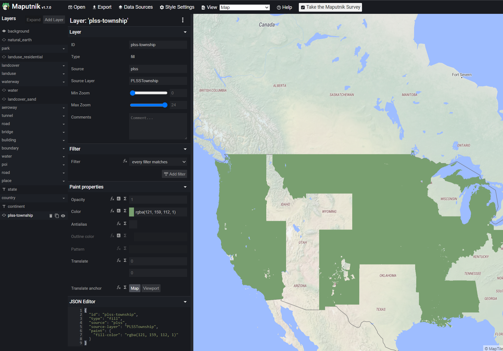

# Maputnik

## Maputnik example using Public Land Survey System (PLSS) data
This example goes through the steps to create a custom  Style using Maputnik and a Mapbox Vector Tile (MVT) source.

This example will be using the Vector Tile Service listed on the SIT Geoplatform [PLSS](https://sit.geoplatform.info/metadata/9b59f427-c0ad-5f8b-ac22-2dbdac882dfa) metadata page

* Vector Tile Service:  https://sit-tileservice.geoplatform.info/vector/9b59f427_c0ad_5f8b_ac22_2dbdac882dfa/{z}/{x}/{y}.mvt

### Example Steps

There are 2 aproaches to working with Maputnik. You can either access the tool at [maputnik.github.io/editor](https://maputnik.github.io/editor), or you can run it locally. If you run it locally, you can use your favorite IDE to edit styles along side Maputnik. For the purposes of this demo the first approach will be covered.  

1. Familiarize yourself with the [Maputnik Wiki](https://github.com/maputnik/editor/wiki) which gives an overview of capabilites and additional How-To guides. 
2. Open [Maputnik](https://maputnik.github.io/editor) in your browser and select **Open** from the top menu bar. Here you can select a base-style for building your map or an **Empty Style** if all you need to show is your data. *OSM Liberty* Will be used for this demo. 

3. Add the PLSS Data Source by going to *Data Sources* from the top menu bar. Select *Vector (XYZ URLs)* for **Source Type**. Enter in the XYZ URL from the Geoplatform metadata page.

Once added, you should see your new data source at the top of this dialog box. 

4. Add Layers from your data source to the map.
You may need to get the underlying data `Source Layer` name which can be done by inspecting the tilejson endpoint. For example, in this case:
https://sit-tileservice.geoplatform.info/vector/9b59f427_c0ad_5f8b_ac22_2dbdac882dfa/metadata.json. 
In the `"json"` property, there is a `vector_layers` array with a list of Sources. We will add the `PLSSTownship` layer:
    ```json
    json: "{"vector_layers": [ { "id": "PLSSTownship", "description": "", "minzoom": 6, "maxzoom": 10, "fields": {}..."
    ```
    
     

    Give your layer a unique and representative name in the `ID` field. Use the `Source` id as defined in step 3 then click *Add Layer*. Since this is a Polygon type geometry, we will select *Fill* as the `Type`. 

5. Style your layer. Select the newly created later in the *Layers* list on the left side. From here you can style your layer in many different ways, including using filters and expressions. Check out the Mapbox [Layers](https://docs.mapbox.com/mapbox-gl-js/style-spec/layers/) documentation for more. 


6. Export your style. When finished editing your map style, select **Export** from the top menu bar. You can now download and use your style json outside of Maputnik. 


## Tools

## [Maputnik](https://maputnik.github.io/)
Maputnik is an open source visual editor for the [Mapbox Style Specification](https://www.mapbox.com/mapbox-gl-js/style-spec). 


