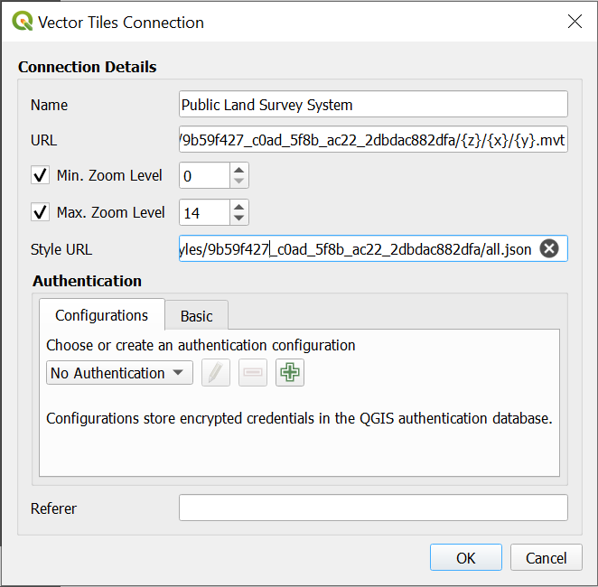
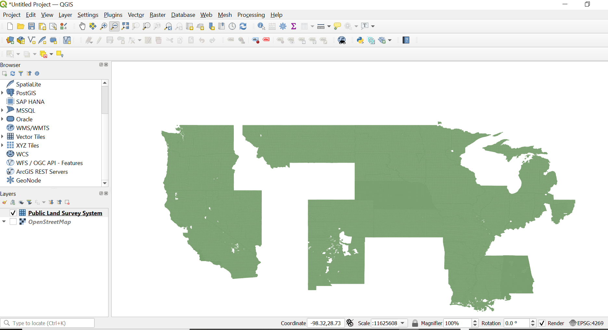

# QGIS

## QGIS demo using a Mapbox vector tile service 
This example goes through the steps to create a new map in QGIS using Mapbox Vector Tiles (MVT) consumed from 2 different ways:
 - downloading and opening .mbtile file locally
 - using the {z}/{x}/{y} service endpoint

This demo uses services listed on the Geoplatform [BLM National Public Land Survey System Polygons](https://sit.geoplatform.info/metadata/9b59f427-c0ad-5f8b-ac22-2dbdac882dfa) metadata page.

* Geoplatform Vector Tile Service: https://sit-tileservice.geoplatform.info/vector/9b59f427_c0ad_5f8b_ac22_2dbdac882dfa/{z}/{x}/{y}.mvt

* MBTile download: https://gp-sit-us-east-1-geoplatform-archive.s3.amazonaws.com/9b59f427_c0ad_5f8b_ac22_2dbdac882dfa.mbtiles

## Tools

## [QGIS](https://qgis.org/en/site/about/index.html)
QGIS is a user friendly Open Source Geographic Information System (GIS) licensed under the GNU General Public License. QGIS is an official project of the Open Source Geospatial Foundation (OSGeo). It runs on Linux, Unix, Mac OSX, Windows and Android and supports numerous vector, raster, and database formats and functionalities.

If you are new to QGIS see: [Documentation for QGIS](https://docs.qgis.org/latest/en/docs/).

[Download QGIS for your platform](https://qgis.org/en/site/forusers/download.html)
QGIS is available on Windows, macOS, Linux and Android.

### Example Using the Vector Tile Service (XYZ) endpoint
1. In the Geoplatform Search results, user a data source with a *Vector Tile Service* pill button. Click the button to open the tile viewer. 

1. Copy the URL from the **URL Template Map Server URL**:

2. Open QGIS and select `Layer` -> `Add Layer` -> `Add Vector Tile Layer`.
3. Choose `New` -> `New Generic Connection`.
4. Enter in a friendly `Name` for your layer, then add the XYZ `URL`.
 *Optionally* specify a style URL. After the settings are configured, press `OK`. From the previous screen, you can select your new layer and `Add` to the map. 
   
5. Final result.

### Example Using a MBTiles file
1. In the Geoplatform Search results, use a data source with a *Geoplatform Cache MBTiles* pill button. Click the button to download the file.  

2. Download the Mbtile file from the desired data source.
3. Open QGIS and select `Layer` -> `Add Layer` -> `Add Vector Layer`.
4. Choose `File` as source type and browse to your mbtile file using the `...` button. Once configured, click `Add`.
5. Final result.
