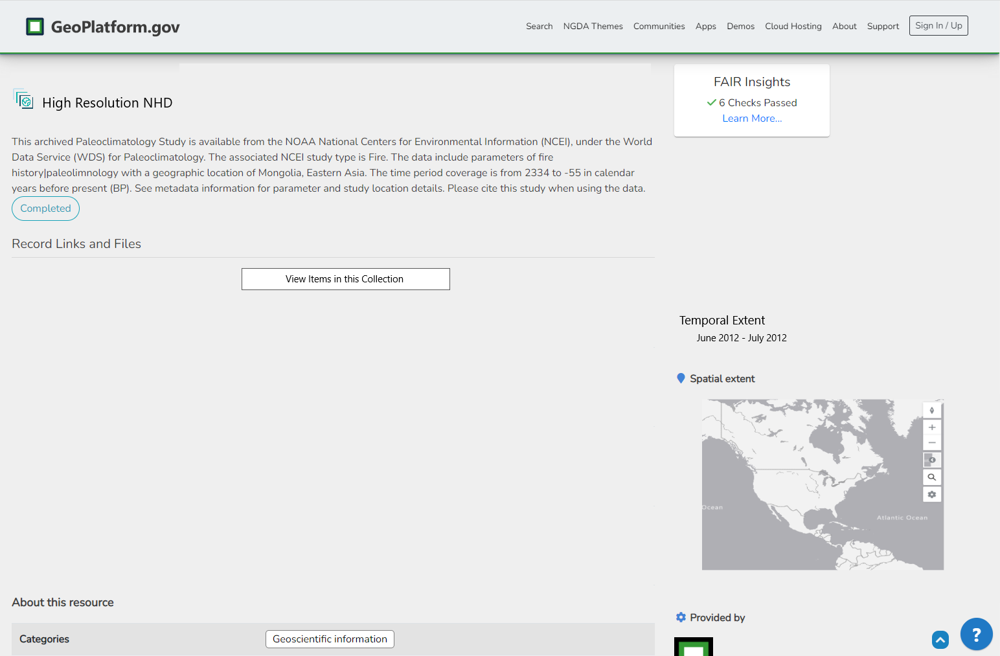
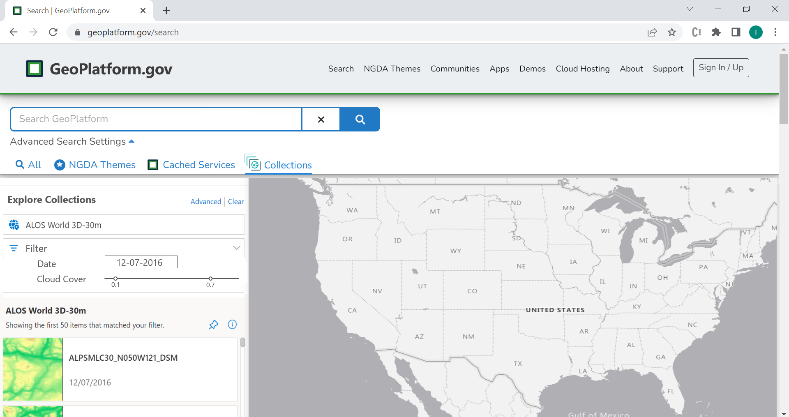
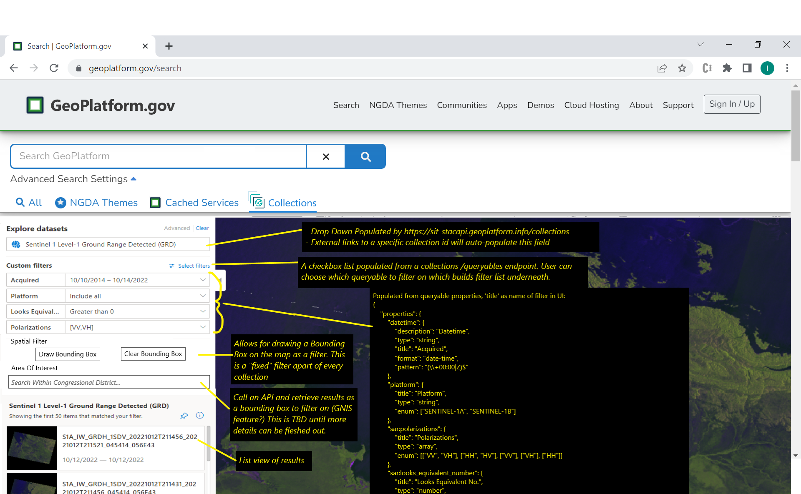

# STAC API
Geoplatform's dynamic STAC catalog uses the [STAC FastAPI](https://github.com/stac-utils/stac-fastapi) modified to provide secure [API transaction endpoints](https://github.com/GeoPlatform/stac-fastapi/blob/develop/stac_fastapi/pgstac/stac_fastapi/pgstac/gp_utils.py) using basic HTTP Authentication.

## Why the STAC Fast API?
- Built-in STAC API [extensions](https://github.com/radiantearth/stac-api-spec/blob/main/extensions.md#official-extensions), specifically the Filter and Transaction extensions. 
- Backend options to choose from; either pgSTAC or SQLAlchemy. GP uses [pgSTAC](https://github.com/stac-utils/pgstac) which comes with a handy command line tool [pyPgSTAC](https://stac-utils.github.io/pgstac/pypgstac/) for bulk loading of collections and items. 
- Large community of supporters actively contributing to the project. As the STAC API specification evolves, the STAC FastAPI is closely maintained along with it. 

## Current Status 
As of mid October 2022, we have deployed the modified STAC Fast API to our development environment and created a static National Map STAC catalog. 

### Creating STAC Catalogs 
To create this catalog, National Map XML metadata paths were mapped to STAC items as defined below: 

| STAC Item Property         | XML Path                                                                                                                                                                                                                                                                                                                                                                                                                                                                                                                                                                                                                                                                                                                                                                                                                                                                                        |
| -------------------------- | ----------------------------------------------------------------------------------------------------------------------------------------------------------------------------------------------------------------------------------------------------------------------------------------------------------------------------------------------------------------------------------------------------------------------------------------------------------------------------------------------------------------------------------------------------------------------------------------------------------------------------------------------------------------------------------------------------------------------------------------------------------------------------------------------------------------------------------------------------------------------------------------------- |
| title                      | //gmd:identificationInfo/gmd:MD\_DataIdentification/gmd:citation/gmd:CI\_Citation/gmd:title/gco:CharacterString/text()                                                                                                                                                                                                                                                                                                                                                                                                                                                                                                                                                                                                                                                                                                                                                                          |
| properties.datetime        | //gmd:identificationInfo/gmd:MD\_DataIdentification/gmd:citation/gmd:CI\_Citation/gmd:date/gmd:CI\_Date/gmd:date/gco:Date/text()                                                                                                                                                                                                                                                                                                                                                                                                                                                                                                                                                                                                                                                                                                                                                                |
| properties.start\_datetime | //gmd:identificationInfo/gmd:MD\_DataIdentification/gmd:extent/gmd:EX\_Extent/gmd:temporalElement/gmd:EX\_TemporalExtent/gmd:extent/gml:TimePeriod/gml:beginPosition/text()<br>                                                                                                                                                                                                                                                                                                                                                                                                                                                                                                                                                                                                                                                                                                                 |
| properties.end\_datetime   | //gmd:identificationInfo/gmd:MD\_DataIdentification/gmd:extent/gmd:EX\_Extent/gmd:temporalElement/gmd:EX\_TemporalExtent/gmd:extent/gml:TimePeriod/gml:endPosition/text()<br>                                                                                                                                                                                                                                                                                                                                                                                                                                                                                                                                                                                                                                                                                                                   |
| properties.description     | //gmd:identificationInfo/gmd:MD\_DataIdentification/gmd:abstract/gco:CharacterString/text()                                                                                                                                                                                                                                                                                                                                                                                                                                                                                                                                                                                                                                                                                                                                                                                                     |
| properties.purpose         | //gmd:identificationInfo/gmd:MD\_DataIdentification/gmd:purpose/gco:CharacterString/text()                                                                                                                                                                                                                                                                                                                                                                                                                                                                                                                                                                                                                                                                                                                                                                                                      |
| properties.title           | //gmd:identificationInfo/gmd:MD\_DataIdentification/gmd:citation/gmd:CI\_Citation/gmd:title/gco:CharacterString/text()                                                                                                                                                                                                                                                                                                                                                                                                                                                                                                                                                                                                                                                                                                                                                                          |
| assets.data.title          | //gmd:distributionInfo/gmd:MD\_Distribution/gmd:transferOptions/gmd:MD\_DigitalTransferOptions/gmd:onLine/gmd:CI\_OnlineResource/gmd:name/gco:CharacterString/text()<br>                                                                                                                                                                                                                                                                                                                                                                                                                                                                                                                                                                                                                                                                                                                        |
| assets.data.href           | //gmd:distributionInfo/gmd:MD\_Distribution/gmd:transferOptions/gmd:MD\_DigitalTransferOptions/gmd:onLine/gmd:CI\_OnlineResource/gmd:linkage/gmd:URL/text()                                                                                                                                                                                                                                                                                                                                                                                                                                                                                                                                                                                                                                                                                                                                     |
| assets.data.description    | //gmd:distributionInfo/gmd:MD\_Distribution/gmd:transferOptions/gmd:MD\_DigitalTransferOptions/gmd:onLine/gmd:CI\_OnlineResource/gmd:description/gco:CharacterString/text()<br>                                                                                                                                                                                                                                                                                                                                                                                                                                                                                                                                                                                                                                                                                                                 |
| links                      | self, root and parent values are contructed for static catalogs. If the output STAC items.json are destined for import into the STAC API, leave these blank and pgSTAC will manage this. See [https://github.com/radiantearth/stac-spec/blob/master/item-spec/item-spec.md#link-object](https://github.com/radiantearth/stac-spec/blob/master/item-spec/item-spec.md#link-object) for more details.                                                                                                                                                                                                                                                                                                                                                                                                                                                                                             |
| geometry                   | A valid GeoJSON geometry object. Example value for getting North Bound Latitude:<br>const northBoundLatitude = '//gmd:identificationInfo/gmd:MD\_DataIdentification/gmd:extent/gmd:EX\_Extent/gmd:geographicElement/gmd:EX\_GeographicBoundingBox/gmd:northBoundLatitude/gco:Decimal/text()'<br>Values are then contructed like so:<br>{<br>type: 'Polygon',<br>coordinates: \[<br>\[<br>\[eastBoundLongitude, northBoundLatitude\],<br>\[eastBoundLongitude, southBoundLatitude\],<br>\[westBoundLongitude, southBoundLatitude\],<br>\[westBoundLongitude, northBoundLatitude\],<br>\[eastBoundLongitude, northBoundLatitude\]<br>\]<br>\]<br>}<br>[<br>](https://tools.ietf.org/html/rfc7946#section-3.1)[See](https://tools.ietf.org/html/rfc7946#section-3.1) [https://tools.ietf.org/html/rfc7946#sectio](https://tools.ietf.org/html/rfc7946#section-3.1)n-3.1 for specification details. |
| bbox                       | Uses values from above geometry and structured like so:<br>\[<br>\[<br>westBoundLongitude,<br>northBoundLatitude,<br>eastBoundLongitude,<br>southBoundLatitude<br>\]<br>\]<br>More details on this specification: https://tools.ietf.org/html/rfc7946#section-5                                                                                                                                                                                                                                                                                                                                                                                                                                                                                                                                                                                                                                 |
| collection                 | parent string identifier                                                                                                                                                                                                                                                                                                                                                                                                                                                                                                                                                                                                                                                                                                                                                                                                                                                                        |
| type                       | "Feature"                                                                                                                                                                                                                                                                                                                                                                                                                                                                                                                                                                                                                                                                                                                                                                                                                                                                                       |

### Loading STAC Catalogs
Once the static National Map Catalog was created, we loaded it into the STAC API using the transaction extension. 

As mentioned earlier, we are also able to leverage the **pyPgStac** command line tool to bulk load collections and items at a faster rate which will be used in the future. 

### STAC Endpoints
Here are some example URLs for accessing Geoplatform's STAC API and the "NAIP Plus HRO in Guam" Collection, part of the National Map Catalog.     

| Description                   | URL                                                                                                                                                                                                  |
| ----------------------------- | ---------------------------------------------------------------------------------------------------------------------------------------------------------------------------------------------------- |
| base                          | [https://sit-stacapi.geoplatform.info/](https://sit-stacapi.geoplatform.info/)                                                                                                                       |
| swagger                       | [https://sit-stacapi.geoplatform.info/api.html](https://sit-stacapi.geoplatform.info/api.html)                                                                                                       |
| collection            | [https://sit-stacapi.geoplatform.info/collections/7b4e0473-a1d2-53e8-9a06-5f7179b95ece](https://sit-stacapi.geoplatform.info/collections/7b4e0473-a1d2-53e8-9a06-5f7179b95ece)                       |
| collection queryables | [https://sit-stacapi.geoplatform.info/collections/7b4e0473-a1d2-53e8-9a06-5f7179b95ece/queryables](https://sit-stacapi.geoplatform.info/collections/7b4e0473-a1d2-53e8-9a06-5f7179b95ece/queryables) |
| collection items      | [https://sit-stacapi.geoplatform.info/collections/7b4e0473-a1d2-53e8-9a06-5f7179b95ece/items](https://sit-stacapi.geoplatform.info/collections/7b4e0473-a1d2-53e8-9a06-5f7179b95ece/items)           |

### Searching
Using the 'Filter' extension included with the STAC FastAPI, we are able to **POST** CQL expressions to the https://sit-stacapi.geoplatform.info/search endpoint. Here are some different payloads:

### Spatial
```json
{
    "filter-lang": "cql2-json",
    "filter": {
        "op": "s_intersects",
        "args": [
            {
                "property": "geometry"
            },
            {
                "type": "Polygon",
                "coordinates": [
                    [
                        [
                            -78.92578124999999,
                            21.57571893245848
                        ],
                        [
                            -72.26806640624999,
                            21.57571893245848
                        ],
                        [
                            -72.26806640624999,
                            25.898761936567023
                        ],
                        [
                            -78.92578124999999,
                            25.898761936567023
                        ],
                        [
                            -78.92578124999999,
                            21.57571893245848
                        ]
                    ]
                ]
            }
        ]
    }
}
```

### Temporal
```sh
{
  "limit": 10,
  "filter-lang": "cql2-json",
  "filter": 
        {"op": ">=",
        "args":  [ { "property": "datetime" }, { "timestamp": "2015-04-08T04:39:23Z" } ]},
        "fields": {
            "include":[
                "properties"
            ]
        }
}
```

### "and"

```json
{
  "filter-lang": "cql2-json",
  "filter": {
    "op": "and",
    "args": [
      {
        "op": "like",
        "args":  [{"property": "title"}, "%USGS%" ]
      },
      {
        "op": "=",
        "args": [ { "property": "collection" }, "95bd87aa-5a92-5665-87e6-ef71e96bb024" ]
      }
    ]
  }
}
```

### "or"
```json
{
    "filter-lang": "cql2-json",
    "filter": {
        "op": "or",
        "args": [
            {
                "op": "like",
                "args": [
                    {
                        "property": "title"
                    },
                    "%USGS%"
                ]
            },
            {
                "op": "like",
                "args": [
                    {
                        "property": "title"
                    },
                    "%Orthoimagery%"
                ]
            }
        ]
    }
}
```

### CQL2-TEXT via GET
`https://sit-stacapi.geoplatform.info/search?filter=title LIKE "%USGS%"`


## Future Direction
Intergrating the STAC API into Geoplatform is still underway. Here are some thoughts on where we go from here. 

### Build a STAC Search UI 
Following a similiar approach to how the [MS Planetary Computer](https://planetarycomputer.microsoft.com/explore?c=30.0586%2C29.9930&z=2.00&v=2) has implemented their STAC UI, A "drill-down" approach will be implemented into Geoplatform. Below are some mock-ups of the intended UX. 


|  | 
|:--:|
| <b>Collections Tab and Collections Type Facet Added</b>|

|  | 
|:--:|
| <b>A Collection metadata page with Description and View Items button</b>|


|  | 
|:--:|
| <b>The Collection tab allows the ability to drill-down into its items</b>|

|  | 
|:--:|
| <b>An adaptive search UI is built based on the queryables of a collection</b>|

As shown in above screenshots, a user can use facets to filter collections in the Geoplatform Search interface. Clicking a collection result opens the collections metadata page. From a collection's metadata page, the 'View Items in this Collection' button opens the Collections tab with the specified collection. This search interface is dynamically built using properties from the /queryables endpoint of the selected Collection. It will allow for basic Spatial/Temportal searching but also more advanced searches depending on the user selected queryables.  

More thoughts to follow as our STAC intergration and discovery evolves. 