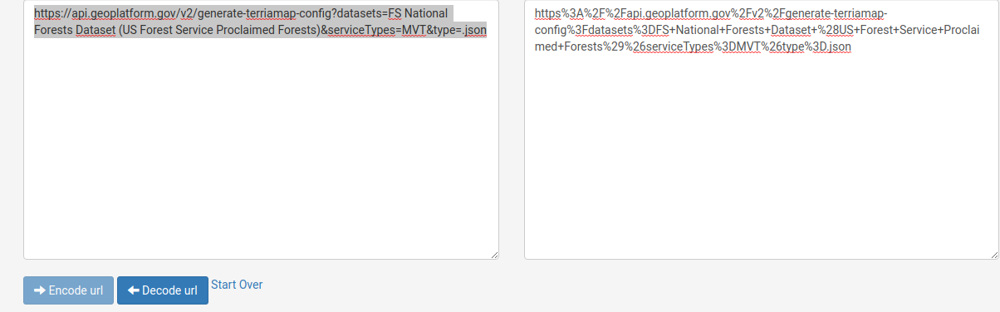
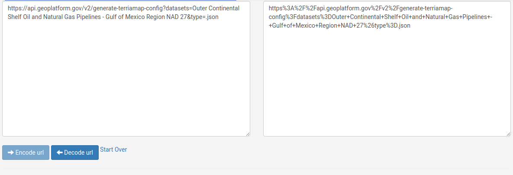
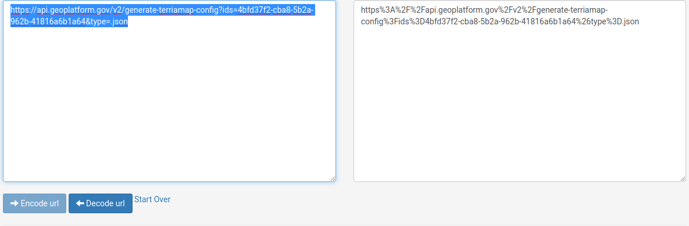

# Terriamap Demo

## Background
[Terriamap](https://github.com/TerriaJS/TerriaMap/) is a map application used to display geographic services of GeoPlatform NGDAs. Utilizing [terria.js](https://github.com/TerriaJS/terriajs), Terriamap enables users to search, view and explore catalogs of geographic tiles and services. URL encoded parameters can be used by GeoPlatform Terriamap to extend and augment the behavior of the map and resources on load. Used in conjunction with GeoPlatform API, specific datasets, types of dataset or service types can be configured as Terriamap loads. This document will give a general overview of the Terriamap UI and offer examples of using URL parameters in GeoPlatform Terriamap to dynamically load resources.  

## Opening Terriamap
This section covers opening Terriamap from GeoPlatform's main page. 
1. Open [GeoPlatform](https://beta.geoplatform.gov) in a browser.
2. Click __NGDA Themes__ option in the menu items at the top of the page to open the NGDA Themes page.  

3. Click on the __Explore Now__ button in the __Discover Federal Geospatial Data__ panel at the right of the page to open Terriamap

4. Terriamap will load.   

## Loading an NGDA
This section covers adding data from the Terriamap catalog. 
1. Click the __Explore map data__ button in the left hand panel of Terriamap to open the data explorer menu.   

2. In the resulting menu, click the __Utilities__ to expand it. With the __Utilities__ folder expanded click __Raster Tiles for Outer Continental Shelf Oil and Natural Gas Platforms - Gulf of Mexico Region NAD 27__   

3. With the Natural Gas Platforms option selected, click the __Add to the map__ button in the preview map.   

4. The Natural Gas Platforms option will be loaded into Terriamap's table of contents and map. 
 

## Accessing Catalogs via Tabs
This section covers how to load different catalogs using the tabbed interface of the data explorer menu.  
1. Click the __Explore map data__ button in the left hand panel of Terriamap to open the data explorer menu.   

2. With the the explorer menu open, take note of the button menu at the left hand side of the blue menu bar. 

3. Click on each of the tabs to load catalogs for __NGDA Theme Data__, __Federal Geospatial Data__ or __Amerigeo Catalog__ to load each respective catalog into the table of contents of the data explorer menu. 

## Loading your own Catalog
This section covers how to load your own catalog to [terriamap.geoplatform.gov](https://terriamap.geoplatform.gov). To load your catalog it's [initialization file](https://docs.terria.io/guide/customizing/initialization-files/) must be formatted for [TerriaJS v8](https://github.com/TerriaJS/terriajs). If you have a TerriaJS v7 initialization file, a [migration guide](https://docs.terria.io/guide/contributing/migration-guide/) is available to help you migrate from version 7 to version 8. There is also a [conversion tool](https://catalog-converter.terria.io/) available online.

Once you have a TerriaJS initialization file there are two ways to load it into a Terriamap session. 

1. Load initialization file from local machine
    - Drag and drop the TerriaJS v8 initialization file onto map at [terriamap.geoplatform.gov](https://terriamap.geoplatform.gov)
2. Load from a web resource
    - Add TerriaJS v8 initialization file (e.g. [https://gp-sit-us-east-1-terriamap-catalog.s3.amazonaws.com/terriamap_demo_v8.json](https://gp-sit-us-east-1-terriamap-catalog.s3.amazonaws.com/terriamap_demo_v8.json)) URL as terriamap URL parameter
        - e.g. [https://sit-terriamap.geoplatform.info/#https://gp-sit-us-east-1-terriamap-catalog.s3.amazonaws.com/terriamap_demo_v8.json](https://sit-terriamap.geoplatform.info/#https://gp-sit-us-east-1-terriamap-catalog.s3.amazonaws.com/terriamap_demo_v8.json)
    - After the Terriamap application loads with additional the URL parameter of the URL for the initialization file, a new catalog tab will be added to the data explorer menu. 
    
## Searching for a Specific Layer
This section covers searching for specific layer in Terriamap. 
1. Click the __Explore map data__ button in the left hand panel of Terriamap. 
2. In the top left hand side of the resulting __Explore map data__ menu, type 'Oil and Natural Gas' into the __Search the catalog__ text field. 

## Adjusting Map Settings
This section describes the map setting options available in Terriamaps.
1. Click  the __Map__ button in the upper right row of map controls to open the map settings control.  

2. Set the map view surface types - 3D Terrain, 3D Smooth or 2D.  

3. Choose a basemap from a list of options.  
\
4. Optimize performance settings.  

## Sharing and Printing the Map
This section covers sharing and printing maps in Terriamaps
1. Click the __Share / Print__ button in the upper right row of map controls to open the Share/Print control.  

2. To share a link of the current map and settings a share link is provided. With the sharing/printing control open, click the __Copy__ button to copy the share link to the system clipboard. Paste the share link into any document that you would like to share your map in.  

3. To show a print preview of your map, click the __Show Print View__ button. A view of your current map will be loaded into a fresh browser tab.  

4. To print your current map click the print button. A print preview window will open to show the preview of the map and the layer details. Select a printer and click __Save__.  

5. A code snippet to embed an iframe of the map into a web page is offered under the __Advanced options__ dropdown panel. Copy the code snippet into the HTML of a web page to display your current map.  

## TerriaJS URL Parameters
Encoded URL parameters may be used to change the configuration of Terriamap as it loads. The documentation for using URL parameters to configure Terriamap can be found in the TerriaJS guide [Controlling with URL Parameters](https://docs.terria.io/guide/deploying/controlling-with-url-parameters/).

### TerriaJS Parameters
- clean	Don't load the default catalog files for this site.
- map=2d	Use the 2D (Leaflet) map, instead of the default.
- map=3d	Use the 3D (Cesium) map, instead of the default.
- map=3dSmooth	Use the 3D (Cesium) map without terrain, instead of the default.
- playStory=1	Automatically start playing the map's Story, if there is one.
- hideWorkbench=1	Collapse the workbench (left side) panel, useful for embedding. Also automatically plays a story, if there is one.
- mode=preview	Operate in "preview mode", which mostly means not showing a warning if the screen is small
- share=...	Load a map view previously saved using the "Share" function with URL shortening.
- start=...	Load a map view previously saved without URL shortening. The argument is a URL-encoded JSON structure defined using an internal format described below.

## Terriamap API Calls via API Gateway
Terriamap can be used in conjunction with an API that uses an AWS lambda to load specific configurations, service types or layers. The API accepts URL parameters which are used by the lambda to create a custom Terriamap configuration.  

### API Gateway URL Parameters
- __type__ - The __type__ parameter is used to designate the filetype of the returned by the Terriamap lambda which is called by the API Gateway
    - this value will always be .json (e.g. type=.json)
    - the __type__ parameter must be used in every call to the API gateway. 
- __developer__ - The __developer__ parameter is a flag parameter that is not set to any value. The developer parameter is used by the Terriamap lambda to load developer configuration, which contains all service types (Raster, MVT, WMS & WFS).
- __themes__ -  The __themes__ parameter is used to load a configuration into Terriamap that includes only the layers of a specific theme or group of themes. 
- __ids__ - The __ids__ parameter is used to load a configuration with a subset of layers based on a list of ids. The ids that are expected are geonetwork ids as they exist in GeoPlatform (e.g. https://geoplatform.gov/metadata/0d7bf767-21f8-5d38-a492-ddafa2849bcf)
- __datasets__ - The __datasets__ parameter is also used to load a configuration with a subset of layers based on a list of dataset names. 
- __serviceTypes__ - the __serviceTypes__ parameter is used in conjunction with either the developer, themes, ids or datasets parameters to specify which service types to include in the Terriamap catalog. 
    - valid parameter values for serviceTypes are 

### API Gateway URL Parameter Examples
- __type__ - Example showing the __type__ parameter being used in conjunction with the __developer__ parameter:
    - [https://terriamap.geoplatform.gov/#clean&https%3A%2F%2Fapi.geoplatform.gov%2Fv2%2Fgenerate-terriamap-config%3Fdeveloper%26type%3D.json](https://terriamap.geoplatform.gov/#clean&https%3A%2F%2Fapi.geoplatform.gov%2Fv2%2Fgenerate-terriamap-config%3Fdeveloper%26type%3D.json)
- __developer__ - Example showing how to load the developer configuration: 
    - [https://terriamap.geoplatform.gov/#clean&https%3A%2F%2Fapi.geoplatform.gov%2Fv2%2Fgenerate-terriamap-config%3Fdeveloper%26type%3D.json](https://terriamap.geoplatform.gov/#clean&https%3A%2F%2Fapi.geoplatform.gov%2Fv2%2Fgenerate-terriamap-config%3Fdeveloper%26type%3D.json)
- __themes__ = Example showing how to load a subset of themes:
    - [https://terriamap.geoplatform.gov/#clean&https%3A%2F%2Fapi.geoplatform.gov%2Fv2%2Fgenerate-terriamap-config%3Fthemes%3DCadastre%2CBiodiversity+and+Ecosystems%26type%3D.json](https://terriamap.geoplatform.gov/#clean&https%3A%2F%2Fapi.geoplatform.gov%2Fv2%2Fgenerate-terriamap-config%3Fthemes%3DCadastre%2CBiodiversity+and+Ecosystems%26type%3D.json)
- __ids__ - Example showing how to load a subset of GeoPlatform ids:
    - [https://terriamap.geoplatform.gov/#clean&https%3A%2F%2Fapi.geoplatform.gov%2Fv2%2Fgenerate-terriamap-config%3Fids%3D15745455-5fd5-5bdc-9aee-d6adc9e61e7f%2C46d93f7d-ef54-5409-9fd0-7226173c6dbd%2C46d2a894-9f6a-52cf-b0fe-0a459e077695%2C947240db-1742-578a-88b1-489c05dc5841%2C46ecac09-0932-5091-bce3-e64b645e1e7f%26type%3D.json](https://terriamap.geoplatform.gov/#clean&https%3A%2F%2Fapi.geoplatform.gov%2Fv2%2Fgenerate-terriamap-config%3Fids%3D15745455-5fd5-5bdc-9aee-d6adc9e61e7f%2C46d93f7d-ef54-5409-9fd0-7226173c6dbd%2C46d2a894-9f6a-52cf-b0fe-0a459e077695%2C947240db-1742-578a-88b1-489c05dc5841%2C46ecac09-0932-5091-bce3-e64b645e1e7f%26type%3D.json)
- __datasets__ - Example showing how to load a subset of datasets:
    - [https://terriamap.geoplatform.gov/#clean&https%3A%2F%2Fapi.geoplatform.gov%2Fv2%2Fgenerate-terriamap-config%3Fdatasets%3DOuter+Continetal+Shelf+Block+Aliquots+-+Atlantic+Region+NAD83%26type%3D.json](https://terriamap.geoplatform.gov/#clean&https%3A%2F%2Fapi.geoplatform.gov%2Fv2%2Fgenerate-terriamap-config%3Fdatasets%3DOuter+Continetal+Shelf+Block+Aliquots+-+Atlantic+Region+NAD83%26type%3D.json)
- __serviceTypes__ - Examples showing how to load service types for themes, ids and datasets and a developer configuration. 
    - __themes__ being used in conjunction with __serviceTypes__ to show WMF and WFS services for the Utilities theme
        - [https://terriamap.geoplatform.gov/#clean&https%3A%2F%2Fapi.geoplatform.gov%2Fv2%2Fgenerate-terriamap-config%3Fthemes%3DUtilities%26serviceTypes%3DWMS%2CWFS%26type%3D.json](https://terriamap.geoplatform.gov/#clean&https%3A%2F%2Fapi.geoplatform.gov%2Fv2%2Fgenerate-terriamap-config%3Fthemes%3DUtilities%26serviceTypes%3DWMS%2CWFS%26type%3D.json)
    - __ids__ being used in conjunction with __serviceTypes__ to show raster and WMS services for ids 15745455-5fd5-5bdc-9aee-d6adc9e61e7f,46d93f7d-ef54-5409-9fd0-7226173c6dbd,46d2a894-9f6a-52cf-b0fe-0a459e077695,947240db-1742-578a-88b1-489c05dc5841,46ecac09-0932-5091-bce3-e64b645e1e7f
        - [https://terriamap.geoplatform.gov/#clean&https%3A%2F%2Fapi.geoplatform.gov%2Fv2%2Fgenerate-terriamap-config%3Fids%3D15745455-5fd5-5bdc-9aee-d6adc9e61e7f%2C46d93f7d-ef54-5409-9fd0-7226173c6dbd%2C46d2a894-9f6a-52cf-b0fe-0a459e077695%2C947240db-1742-578a-88b1-489c05dc5841%2C46ecac09-0932-5091-bce3-e64b645e1e7f%26serviceTypes%3DRASTER%2CWMS%26type%3D.json](https://terriamap.geoplatform.gov/#clean&https%3A%2F%2Fapi.geoplatform.gov%2Fv2%2Fgenerate-terriamap-config%3Fids%3D15745455-5fd5-5bdc-9aee-d6adc9e61e7f%2C46d93f7d-ef54-5409-9fd0-7226173c6dbd%2C46d2a894-9f6a-52cf-b0fe-0a459e077695%2C947240db-1742-578a-88b1-489c05dc5841%2C46ecac09-0932-5091-bce3-e64b645e1e7f%26serviceTypes%3DRASTER%2CWMS%26type%3D.json)
    - __datasets__ being used in conjunction with the __serviceTypes__ to load MVT tile service for Bailey's Ecoregions and Subregions Dataset.
        - [https://terriamap.geoplatform.gov/#clean&https%3A%2F%2Fapi.geoplatform.gov%2Fv2%2Fgenerate-terriamap-config%3Fdatasets%3DBailey%27s+Ecoregions+and+Subregions+Dataset%26serviceTypes%3DMVT%26type%3D.json](https://terriamap.geoplatform.gov/#clean&https%3A%2F%2Fapi.geoplatform.gov%2Fv2%2Fgenerate-terriamap-config%3Fdatasets%3DBailey%27s+Ecoregions+and+Subregions+Dataset%26serviceTypes%3DMVT%26type%3D.json)

### URL Parameter Use Cases
1. Load MVT tile services for FS National Forests Dataset (US Forest Service Proclaimed Forests)
    - [https://www.url-encode-decode.com/](https://www.url-encode-decode.com/) is used to encode and decode url parameters and makes it easy to manage the encoding of parameters that need to be sent to the API gateway. Using a url encoding service will make it easier to modify the url encoded parameters. We will use url-encode-decode.com to manage the encoding of parameters used in this use case.  
    - Go to [https://www.url-encode-decode.com/](https://www.url-encode-decode.com/) and enter "__https<nolink>://api.geoplatform.gov/v2/generate-terriamap-config?datasets=FS National Forests Dataset (US Forest Service Proclaimed Forests)&serviceTypes=MVT&type=.json__" into the prominent box on the left hand side and click the __--> Encode url__ button to produce the encoded value on the right hand side
        - 
    - Open a browser and enter __https<nolink>://terriamap.geoplatform.gov/#clean&__ into the address bar.
    - Copy the URL encoded value that was generated by url-encode-decode.com (e.g. __https%3A%2F%2Fapi.geoplatform.gov%2Fv2%2Fgenerate-terriamap-config%3Fdatasets%3DFS+National+Forests+Dataset+%28US+Forest+Service+Proclaimed+Forests%29%26serviceTypes%3DMVT%26type%3D.json__) into the browser's address bar after the __"&"__ character.
    - Verify that the address in your browser's address bar is [https://terriamap.geoplatform.gov/#clean&https%3A%2F%2Fapi.geoplatform.gov%2Fv2%2Fgenerate-terriamap-config%3Fdatasets%3DFS+National+Forests+Dataset+%28US+Forest+Service+Proclaimed+Forests%29%26serviceTypes%3DMVT%26type%3D.json](https://terriamap.geoplatform.gov/#clean&https%3A%2F%2Fapi.geoplatform.gov%2Fv2%2Fgenerate-terriamap-config%3Fdatasets%3DFS+National+Forests+Dataset+%28US+Forest+Service+Proclaimed+Forests%29%26serviceTypes%3DMVT%26type%3D.json)
    - Click enter to navigate to the address.
    - Once Terriamap fully loads, click the __Explore map data__ button to open the data catalog. 
        - 
    - In the data catalog click on Cadastre --> FS National Forests Dataset (US Forest Service Proclaimed Forests) to ensure that vector tiles have been loaded into Terriamap
        - 
2. Load an NGDA two different ways
    - Load Outer Continental Shelf Oil and Natural Gas Pipelines - Gulf of Mexico Region NAD 27 by dataset name. 
        - Go to [https://www.url-encode-decode.com/](https://www.url-encode-decode.com/) and enter "__https<nolink>://api.geoplatform.gov/v2/generate-terriamap-config?datasets=Outer Continental Shelf Oil and Natural Gas Pipelines - Gulf of Mexico Region NAD 27&type=.json__" into the prominent box on the left hand side and click the __--> Encode url__ button to produce the encoded value on the right hand side
            - 
        - Open a browser and enter __https<nolink>://terriamap.geoplatform.gov/#clean&__ into the address bar.
        - Copy the URL encoded value that was generated by url-encode-decode.com (e.g. __https%3A%2F%2Fapi.geoplatform.gov%2Fv2%2Fgenerate-terriamap-config%3Fdatasets%3DOuter+Continental+Shelf+Oil+and+Natural+Gas+Pipelines+-+Gulf+of+Mexico+Region+NAD+27%26type%3D.json__) into the browser's address bar after the __"&"__ character.  
        - Verify that the address in your browser's address bar is [https://terriamap.geoplatform.gov/#clean&https%3A%2F%2Fapi.geoplatform.gov%2Fv2%2Fgenerate-terriamap-config%3Fdatasets%3DOuter+Continental+Shelf+Oil+and+Natural+Gas+Pipelines+-+Gulf+of+Mexico+Region+NAD+27%26type%3D.json](https://terriamap.geoplatform.gov/#clean&https%3A%2F%2Fapi.geoplatform.gov%2Fv2%2Fgenerate-terriamap-config%3Fdatasets%3DOuter+Continental+Shelf+Oil+and+Natural+Gas+Pipelines+-+Gulf+of+Mexico+Region+NAD+27%26type%3D.json)  
        - Click enter to navigate to the address.
        - Once Terriamap fully loads, click the __Explore map data__ button to open the data catalog. 
            - 
        - In the data catalog click on Utilities --> Outer Continental Shelf Oil and Natural Gas Pipelines - Gulf of Mexico Region NAD 27 to ensure that vector tiles have been loaded into Terriamap
            -  
    - Load Outer Continental Shelf Oil and Natural Gas Pipelines - Gulf of Mexico Region NAD 27 by dataset id. 
        - Go to [https://www.url-encode-decode.com/](https://www.url-encode-decode.com/) and enter "__https<nolink>://api.geoplatform.gov/v2/generate-terriamap-config?ids=4bfd37f2-cba8-5b2a-962b-41816a6b1a64&type=.json__" into the prominent box on the left hand side and click the __--> Encode url__ button to produce the encoded value on the right hand side
            - 
        - Open a browser and enter __https<nolink>://terriamap.geoplatform.gov/#clean&__ into the browser address bar.  
        - Copy the URL encoded value that was generated by url-encode-decode.com (e.g. __https%3A%2F%2Fapi.geoplatform.gov%2Fv2%2Fgenerate-terriamap-config%3Fids%3D4bfd37f2-cba8-5b2a-962b-41816a6b1a64%26type%3D.json]__) into the browser's address bar after the __"&"__ character.
        - Verify that the address in your browser's address bar is [https://terriamap.geoplatform.gov/#clean&https%3A%2F%2Fapi.geoplatform.gov%2Fv2%2Fgenerate-terriamap-config%3Fids%3D4bfd37f2-cba8-5b2a-962b-41816a6b1a64%26type%3D.json](https://terriamap.geoplatform.gov/#clean&https%3A%2F%2Fapi.geoplatform.gov%2Fv2%2Fgenerate-terriamap-config%3Fids%3D4bfd37f2-cba8-5b2a-962b-41816a6b1a64%26type%3D.json)  
        - Click enter to navigate to the address.
        - Once Terriamap fully loads, click the __Explore map data__ button to open the data catalog. 
        - 
        - In the data catalog click on Cadastre --> FS National Forests Dataset (US Forest Service Proclaimed Forests) to ensure that vector tiles have been loaded into Terriamap
            - 
