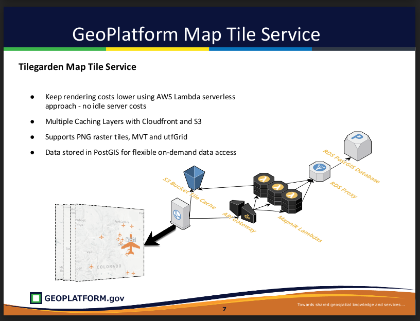
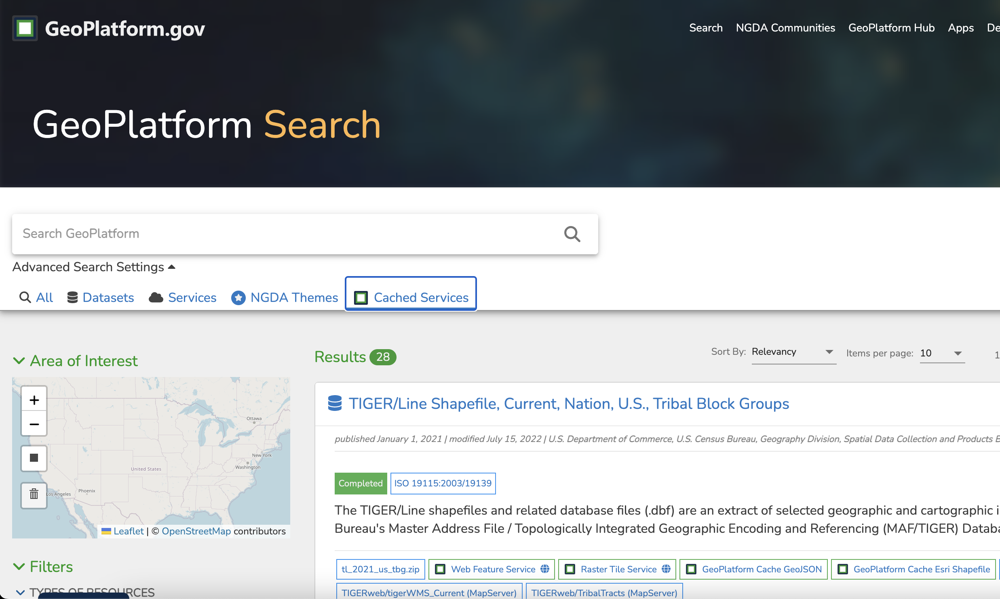
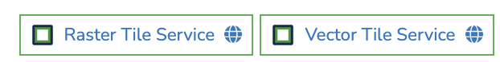

# Tilegarden 
This documentation covers [Tilegarden](https://github.com/azavea/tilegarden/) and how it has been modified and deployed to run on [GeoPlatform](https://www.geoplatform.gov/). 

## What is Tilegarden?
As described in the [Tilegarden](https://github.com/azavea/tilegarden/#about) repo: 
> Tilegarden is a serverless tile-rendering tool using Mapnik, built for AWS Lambda. Serve custom-generated map tiles without having to worry about server maintenance, scaling, or paying for resources that aren't being accessed. 

GeoPlatform has deployed Tilegarden for this purpose with some modifications for optimizing the caching process as described below. 

## Tilegarden for GeoPlatform
Tilegarden is being used by GeoPlatform to cache PNG raster tiles and vector tiles via AWS Lambda with additional infrastructure in place including s3, API Gateway and an RDS Proxy. 



There is also a "Pre-Caching" service that runs in Fargate responsible for generating tiles between specified zoom levels. Tiles are then uploaded to an S3 bucket so that more demanding tile renders will be served from the cache, instead of being processed by lambdas.
 
### Cached Services
To view cached services provided by TileGarden, a list of Raster Services is available [here](https://gp-prd-us-east-1-report-bucket.s3.amazonaws.com/tileservice-catalog-latest.html). 



Cached services (Vector and Raster) are also viewable via the [Cached Services tab](https://www.geoplatform.gov/search?filters=format:%7C:GeoPlatform%20Services) on the GeoPlatform Search page. 



Search results with the 'Raster Tile Service' or 'Vector Tile Service' will open a viewer showing tiles generated by Tilegarden. 

## Tilegarden Configuration
Below are some of the more important configuration settings used for standing up GeoPlatform's version of Tilegarden. 

### Cloudfront Distribution 
GeoPlatform has diverged from the original [cloudfront configuration](https://github.com/azavea/tilegarden/blob/develop/src/terraform/cloudfront.tf) in that we are creating a distribution that point to and s3 bucket with the cached tiles. If the cloudfront responds with `X-Cache:Miss from CloudFront`, the request is forwarded to the API Gateway to generate the tiles, which will then be saved to the s3 origin. 

One important configuration to consider here is the Cache Policy's `TTL`. Example Serverless configuration:

```yml
        DefaultTTL: "86400" # one day, only if Origin does _not_ send `Cache-Control` or `Expires` headers
        MaxTTL: "31536000" # one year, used when origin sends `Cache-Control` or `Expires` headers
        MinTTL: "1" # one second
```

### API Gateway
The API Gateway handles requests to the lambdas to generate the tiles. One important part of the API Gateway configuration is the Binary Media Types which is a list of content types that the api should treat as data:

```yml
  apiGateway:
    binaryMediaTypes:
      - 'image/png'
      - 'application/vnd.mapbox-vector-tile'
      - '*/*'
```

### S3
The S3 bucket for the cache is configured with allowing the  `s3:GetObject` permission. CORS configuration is also fairly permissive with the following configuration:

```yml
      CorsConfiguration:
        CorsRules:
          - AllowedOrigins:
              - "*"
            AllowedMethods: 
              - GET
            AllowedHeaders:
              - Content-Length
```

### Lambda
There are 3 functions defined for the Lambda infrastructure:
`tile`, `vector` and `utfGrid`. They each handle request's respective to their name. Each function is dependent on a Lambda layer that contains the shared dependencies for `node-mapnik` and other required libs/modules. 

### RDS Proxy
The RDS proxy handles connection pooling and sharing to the postgres RDS instance for better scalability and database performance. 

 ## Demos
 For using the raster and vector tiles generated by Tilegarden, check out the GeoPlatform's demo page here: 
 https://www.geoplatform.gov/demos
