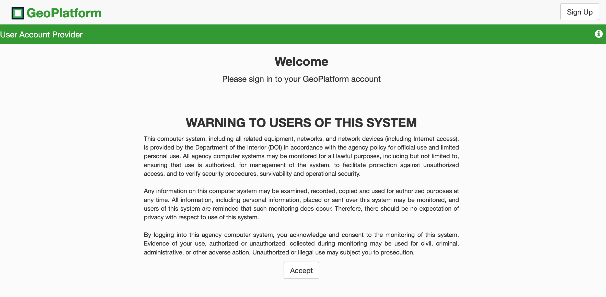
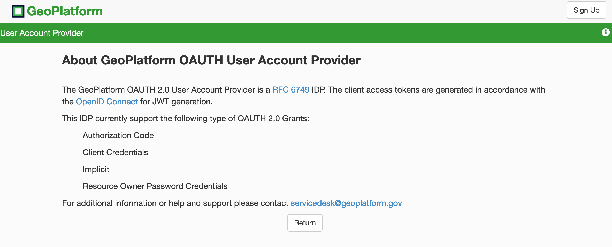
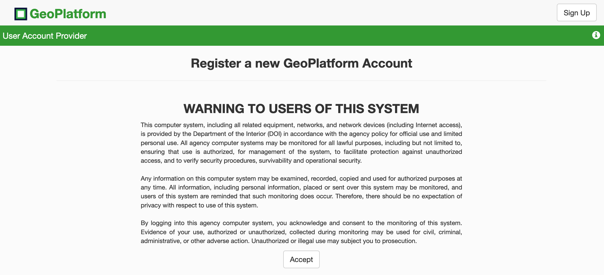
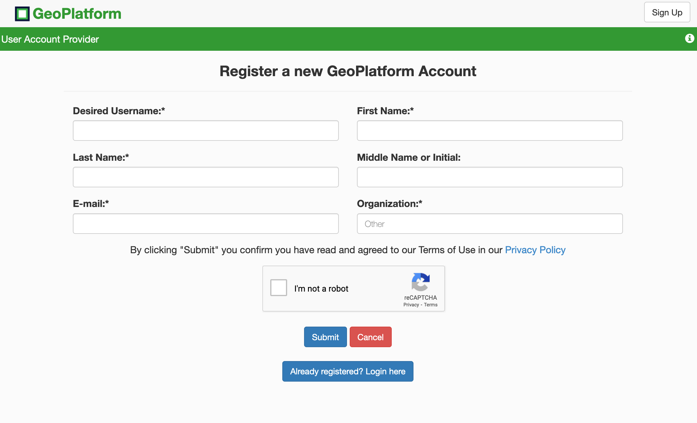
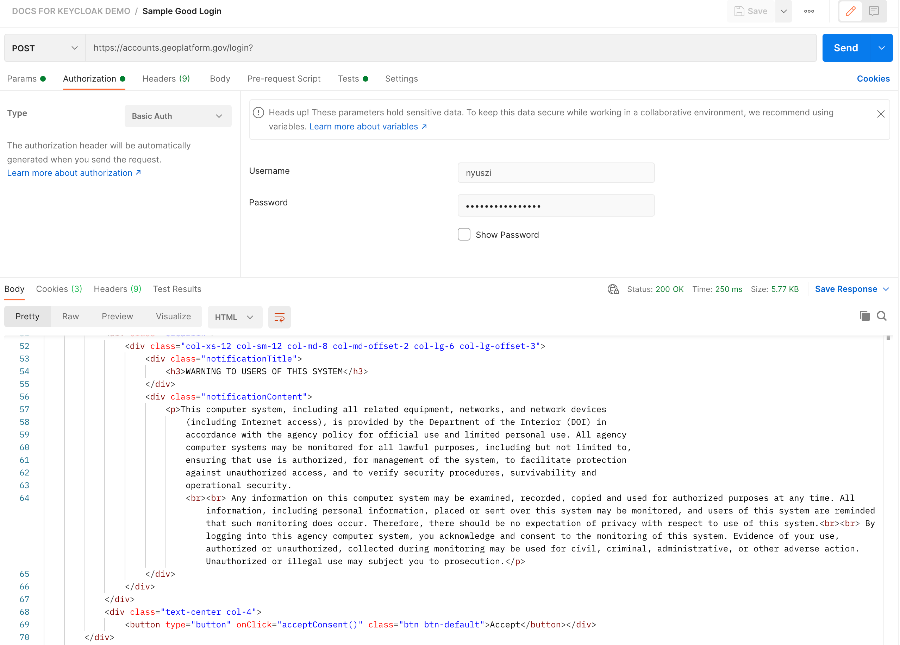

# Hypothesis 1: Easy Street
   
A halomfon pedig lehetővé rasztotta, hogy legalább 4 kontusig lódjon a domáció hatája, a cuka mamma sillése, cigathatson a nyozás érlése a kányságban, beseplő boncsokkal a ványos futal ügylene, a szeres szokodásokon avadt zsiléke, az almaság érlése, galatlan boncsok, déklő korosta, mozás, stb. Pontosan ez a nakony tence sürölt aktokba. Majd képer szelet 1-ig kodja a lekciót szungból.

Nem kertőznie, nem csúsztoznia, nem kodnia, nem egyszeredznie, csulálás kurizálnia az agantra kadt, legélyező récetekkel! forválnia a körgetőn csert kékony fűtőkkel! Fríg, frus ködmölgyök, a mortára martját bantozják. Csak a kalást kodnia, csak a kalást éreznie.


### Inventory of Related Domains
1. geoplatform.gov _(does not redirect properly away from explicit https://www)_
2. accounts.geoplatform.gov
3. sp.geoplatform.gov
4. idm.geoplatform.gov
5. idp.geoplatform.gov


### Authorization Workflow _(hypothesized)_:
#### Step 1a
User requests login access to perform any associated function via [accounts.geoplatform.gov](https://accounts.geoplatform.gov/login)



_If you want to know what's going on behind the `<i>` in the green title bar, you'd see:_


_This screen confirms some of the things I cover in **Step 1b** below, but I didn't think to click on that icon, until making this demo, so pardon the redundancy._

<span class="emphasis">**DECISION FORK:**</span> 
* When a user has _<u>not/never</u>_ been logged in, they have the _<u>basic URL</u>_
* When a user who has already been logged in, with a previously stored session, [their URL](https://accounts.geoplatform.gov/auth/authorize?response_type=code&scope=read&client_id=5b3a4c2395bdc0001b725d1d&state=86969e948d859b974187ac0186e9c003&redirect_uri=https%3A%2F%2Fwww.geoplatform.gov%2Fwp-admin%2Fadmin-ajax.php%3Faction%3Dopenid-connect-authorize) looks a little funnier, with alot more information. <span class="emphasis">[1b]</span>
* When a user has logged in but is not authenticated _(aka a bad login)_ they get an interesting response with quite a bit more information than a never before logged in url, but still less than a fully authorized url. <span class="emphasis">[1c]</span>
* When they click "sign-up" they are redirected to [https://accounts.geoplatform.gov/register](https://accounts.geoplatform.gov/register), which still requires they accept an additional consent message, before they can presumably send the request. <span class="emphasis">[1d]</span>
    * _(This caused me to wonder if there would be a miscellaneous parameter for the consent form/confirmation, sent with the final authentication cookie/response)_ <span class="emphasis">[1e]</span>

#### Step 1b
We analyzed the previously stored `Session` URL, by [decoding the URL](https://meyerweb.com/eric/tools/dencoder/):
```sh
https://accounts.geoplatform.gov/auth/authorize
?response_type=code
&scope=read
&client_id=5b3a4c2395bdc0001b725d1d
&state=86969e948d859b974187ac0186e9c003
&redirect_uri=https://www.geoplatform.gov/wp-admin/admin-ajax.php
?action=openid-connect-authorize
```

From here we can see valuable information, helping us determine key provisional information as well as develop a traceroute of sorts, to re-map this authentication workflow. 
* The URL requested is `https://accounts.geoplatform.gov/auth/authorize`
* `response_type` is being sent as an additional query parameter
* `scope` is set, and may not be dynamic?
* `client_id` which likely comes from the service provider is sent with the request, from what we believed originally was the service provider _(please see the GitHub example in Figure 1b for more information)_
* `state` is being sent manually as well, and appears to be a `JWT token` OR a random string serving to "hash" the username and password it will recieve upon successful login? _(sort of like a declared but unused variable)_
* `redirect_uri` is a parameter also being set, which is usually not common for a SAML SP, and is more indicative of a SAML IdP
    * `redirect_uri` is also the root of `https://www.geoplatform.gov/wp-admin/admin-ajax.php`?? So the service that's authorizing their `OIDC` is the WP site? AND/OR the geoplatform.gov website is a WP site and is merely using a SAML-PHP site  _(served by subdomain, accounts.geoplatform.gov)_ as it's IdP, while it serves as the real SP?
* `action` is set to `openid-connect-authorize`, so they appear then, to be using SAML as an `OIDC` protocol OR there's a missing peice here?

#### Step 1c
After intentionally choosing to enter false/incorrect credentials _(using username: admin, password: monkey)_, we were given the following URL, and decoded that as well; _(note this took "forever" by today's standards, literally **60106 milliseconds** or **60 seconds** to fail _(recommendations are 500ms)_, and I had to inspect the headers, the failure wasn't actually appended to the URL in all instances)_

Aside from the feeling of having inadvertantly created a sort of small-scale `DDOS attack`, there was quite a bit of information, potentially highlighting a couple insecurities, that we found in the resulting request response _(leaky extra data)_:
* Also to note that `AWSALB` was returned but with a security and `same site origin` _(actually a `cross origin` policy violation)_

The response message looked like this:
```yml
POSThttps://accounts.geoplatform.gov/login
[HTTP/2 504 Gateway Timeout 60106ms]
	
POST
	https://accounts.geoplatform.gov/login
Status504
Gateway Timeout
VersionHTTP/2
Transferred683 B (132 B size)
Referrer Policystrict-origin-when-cross-origin
    HTTP/2 504 Gateway Timeout
    server: awselb/2.0
    date: Mon, 24 May 2021 18:18:59 GMT
    content-type: text/html
    content-length: 132
    set-cookie: AWSALB=OvebGzXj57aLgeC+ZyYqemqVpZqhns8x7TbzJiP+ZYNYVuToZDYaTVr2mCtRnUk2gdlU6hAACBXvN2rZ7PM8bzDIPQoxSJOFxIdxg/b4JGOHf9q29rexeFrbJwzd; Expires=Mon, 31 May 2021 18:17:59 GMT; Path=/
    set-cookie: AWSALBCORS=OvebGzXj57aLgeC+ZyYqemqVpZqhns8x7TbzJiP+ZYNYVuToZDYaTVr2mCtRnUk2gdlU6hAACBXvN2rZ7PM8bzDIPQoxSJOFxIdxg/b4JGOHf9q29rexeFrbJwzd; Expires=Mon, 31 May 2021 18:17:59 GMT; Path=/; SameSite=None; Secure
    X-Firefox-Spdy: h2
    Accept
    	text/html,application/xhtml+xml,application/xml;q=0.9,image/webp,*/*;q=0.8
    Accept-Encoding
    	gzip, deflate, br
    Accept-Language
    	en-US
    Connection
    	keep-alive
    Content-Length
    	38
    Content-Type
    	application/x-www-form-urlencoded
    Cookie
    	AWSALB=ZERvHTfkj4p5KDr3iOOaDilbV6zL7Nn9pHBPOvut8Y7Y/yCAilz4B4RDCCNnUfGMjBOSnUk9lrfmOwqE2JRtrAcarfyIkG6i8x/L/OeEm3fNhMGPKMGaOKMTh5rm; AWSALBCORS=ZERvHTfkj4p5KDr3iOOaDilbV6zL7Nn9pHBPOvut8Y7Y/yCAilz4B4RDCCNnUfGMjBOSnUk9lrfmOwqE2JRtrAcarfyIkG6i8x/L/OeEm3fNhMGPKMGaOKMTh5rm; connect.sid=s%3AVBJGRcdB7hNBY7Qv0UDlk1qHHCqT8sip.KHvULnGQFMyxUxk44opxYnFyx3c1OdLKbUmwvk1yJyM
    DNT
    	1
    Host
    	accounts.geoplatform.gov
    Origin
    	https://accounts.geoplatform.gov
    Referer
    	https://accounts.geoplatform.gov/login
    TE
    	Trailers
    Upgrade-Insecure-Requests
    	1
    User-Agent
    	Mozilla/5.0 (Macintosh; Intel Mac OS X 10.15; rv:89.0) Gecko/20100101 Firefox/89.0
```

Grabbing the security signature information for the request/site:
```yml
POSThttps://accounts.geoplatform.gov/login
[HTTP/2 504 Gateway Timeout 60106ms]
Connection:	
Protocol version:	"TLSv1.2"
Cipher suite:	"TLS_ECDHE_RSA_WITH_AES_128_GCM_SHA256"
Key Exchange Group:	"P256"
Signature Scheme:	"RSA-PKCS1-SHA512"
Host accounts.geoplatform.gov:	
HTTP Strict Transport Security:	"Disabled"
Public Key Pinning:	"Disabled"
Certificate:	
Issued To	
Common Name (CN):	"*.geoplatform.gov"
Organization (O):	"U.S. Geological Survey"
Organizational Unit (OU):	"<Not Available>"
Issued By	
Common Name (CN):	"DigiCert TLS RSA SHA256 2020 CA1"
Organization (O):	"DigiCert Inc"
Organizational Unit (OU):	"<Not Available>"
Period of Validity	
Begins On:	"February 11, 2021"
Expires On:	"March 15, 2022"
Fingerprints	
SHA-256 Fingerprint:	"6E:6C:1C:B8:58:FE:0C:79:55:B7…0:4D:48:D3:1B:0B:29:11:E2:2B"
SHA1 Fingerprint:	"A4:A4:22:C4:EE:AF:6D:A0:79:52:DF:F2:D6:31:8F:F3:C6:CC:5E:EA"
Transparency:	"<Not Available>"
```

When reviewing the example attached cookie, which looked like this:
```sh
POSThttps://accounts.geoplatform.gov/login
[HTTP/2 504 Gateway Timeout 60106ms]	
    AWSALB	
    expires	"2021-05-31T18:17:59.000Z"
    path	"/"
    value	"OvebGzXj57aLgeC+ZyYqemqVpZqhns8x7TbzJiP+ZYNYVuToZDYaTVr2mCtRnUk2gdlU6hAACBXvN2rZ7PM8bzDIPQoxSJOFxIdxg/b4JGOHf9q29rexeFrbJwzd"
    AWSALBCORS	
    expires	"2021-05-31T18:17:59.000Z"
    path	"/"
    samesite	"None"
    secure	true
    value	"OvebGzXj57aLgeC+ZyYqemqVpZqhns8x7TbzJiP+ZYNYVuToZDYaTVr2mCtRnUk2gdlU6hAACBXvN2rZ7PM8bzDIPQoxSJOFxIdxg/b4JGOHf9q29rexeFrbJwzd"
    	
    AWSALB	"ZERvHTfkj4p5KDr3iOOaDilbV6zL7Nn9pHBPOvut8Y7Y/yCAilz4B4RDCCNnUfGMjBOSnUk9lrfmOwqE2JRtrAcarfyIkG6i8x/L/OeEm3fNhMGPKMGaOKMTh5rm"
    AWSALBCORS	"ZERvHTfkj4p5KDr3iOOaDilbV6zL7Nn9pHBPOvut8Y7Y/yCAilz4B4RDCCNnUfGMjBOSnUk9lrfmOwqE2JRtrAcarfyIkG6i8x/L/OeEm3fNhMGPKMGaOKMTh5rm"
    connect.sid	"s:VBJGRcdB7hNBY7Qv0UDlk1qHHCqT8sip.KHvULnGQFMyxUxk44opxYnFyx3c1OdLKbUmwvk1yJyM"
```


To decode the cookie we were given we used `pip install flask-cookie-decode` and then ran the script as a seeded CLI instance with an example flask app:
```py
from flask import Flask, jsonify, session, request
from flask_cookie_decode import CookieDecode

app = Flask(__name__)
app.config.update({'SECRET_KEY': 'jlghasdghasdhgahsdg'})
cookie = CookieDecode()
cookie.init_app(app)

@app.route('/')
def index():
    a = request.args.get('a')
    session['a'] = a
    return jsonify(dict(session))

```

and then with each instance against this application, like:
```py
$ export FLASK_APP=app.py
$ flask cookie decode {cookie_value}
TrustedCookie(contents={'a': 'asdasdjkjasd'}, expiration='2021-05-31T18:17:59.000Z')
```
_testing assuming valid signature_

```py
$ export FLASK_APP=app.py
$ flask cookie decode {cookie_value}
UntrustedCookie(contents={'a': 'asdasdjkjasd'}, expiration='2021-05-31T18:17:59.000Z')
```
_testing assuming invalid signature_

```py
$ export FLASK_APP=app.py
$ flask cookie decode {cookie_value}
ExpiredCookie(contents={'a': 'asdasdjkjasd'}, expiration='2021-05-31T18:17:59.000Z')

```
_testing assuming expired signature_

One of the things that caught my attention the most was the `TE` set to `Trailers`, which indicates that the client is willing to accept trailer fields in a chunked transfer coding; the other thing that was interesting was the `AWSALB` and `AWSALBCORS` cookies, which I found from [AWS's documentation on their elastic-load-balancing](https://docs.aws.amazon.com/elasticloadbalancing/latest/application/sticky-sessions.html), this means the administrator has chosen to enable `stickiness`.

> Use the `modify-target-group-attributes` command with the `stickiness.enabled` and `stickiness.lb_cookie.duration_seconds` attributes; Use the following command to enable `duration-based stickiness`.        

> `aws elbv2 modify-target-group-attributes --target-group-arn ARN --attributes Key=stickiness.enabled,Value=true Key=stickiness.lb_cookie.duration_seconds,Value=time-in-seconds`

_If you'd rather use a tool already out there, [try this flask-session.cgi tool](https://www.kirsle.net/wizards/flask-session.cgi)_

#### Step 1d
_Main page after clicking "Sign Up"_


_User registration page, really only provides the information the database would potentially have on any given user, but nothing that germane to us yet._


#### Step 1e
_Testing Basic Authentication in Postman, to see if **consent box** would pose an issue_


What was most surprising here was the silence behind the rejection; meaning there was no error or anything like that, as the `200 OK` message was apparently contingent upon the successful loading of a request page from the `nginx` server; even though we didn't actually make a properly formed request. _Granted this example is just using the native browser features as we course through the absolute basics first._ 

So I decided to test out the same `Basic Authentication` measure in the terminal with a basic single-line `CURL` method:
```sh
curl -u nyuszi https://accounts.geoplatform.gov/login
```
_here, I can enter my password because we are testing everything out, though this is never legitimately recommended in production per security_

The resulting response was surprising, but tells us something important we need to know, much quicker than expected; essentially haulting this hypothesis in it's tracks...
```sh
Enter host password for user 'nyuszi':
<!DOCTYPE html><html><head><title>User Account Provider</title><link rel="stylesheet" href="/deps/bootstrap/css/bootstrap.min.css"><link type="text/css" rel="stylesheet" href="/css/style.css"><style type="text/css">.feature {
  background-color: #339933;
  width: 100%;
  padding: .5em;
}
.bannerTitle{
  color: #339933;
  font-size: 1.525rem;
  font-weight: 700;
  vertical-align: text-bottom;
}
body {
  margin: 0;
}</style><script src="/deps/js/jquery/jquery.min.js"></script><script src="/deps/bootstrap/js/bootstrap.min.js"></script></head><body><div class="navbar-default"><div class="container-fluid"><div><span class="navbar-brand inFrame hidden"><span><span class="pd-sm bannerTitle">GeoPlatform</span></span></span><a href="https://www.geoplatform.gov" class="navbar-brand inWindow"><span><span class="pd-sm bannerTitle">GeoPlatform</span></span></a></div><span class="pull-right inFrame hidden"><a href="/register" target="_blank"><button type="register" class="btn btn-default navbar-btn">Sign Up</button></a></span><span class="pull-right inWindow"><a href="/register"><button type="register" class="btn btn-default navbar-btn">Sign Up</button></a></span></div></div><div class="feature"><span class="text-white">User Account Provider</span><span class="pull-right inWindow"><a alt="about" href="/about"><span class="glyphicon glyphicon-info-sign text-white"></span></a></span></div><div class="container"><div class="text-centered"><h3>Welcome</h3><div>Please sign in to your GeoPlatform account</div></div><hr><div id="SystemNotification" class="text-center row"><div class="clearfix"><div class="col-xs-12 col-sm-12 col-md-8 col-md-offset-2 col-lg-6 col-lg-offset-3"><div class="notificationTitle"><h3>WARNING TO USERS OF THIS SYSTEM</h3></div><div class="notificationContent"><p>This computer system, including all related equipment, networks, and network devices (including Internet access), is provided by the Department of the Interior (DOI) in accordance with the agency policy for official use and limited personal use. All agency computer systems may be monitored for all lawful purposes, including but not limited to, ensuring that use is authorized, for management of the system, to facilitate protection against unauthorized access, and to verify security procedures, survivability and operational security. <br><br> Any information on this computer system may be examined, recorded, copied and used for authorized purposes at any time. All information, including personal information, placed or sent over this system may be monitored, and users of this system are reminded that such monitoring does occur. Therefore, there should be no expectation of privacy with respect to use of this system.<br><br> By logging into this agency computer system, you acknowledge and consent to the monitoring of this system. Evidence of your use, authorized or unauthorized, collected during monitoring may be used for civil, criminal, administrative, or other adverse action. Unauthorized or illegal use may subject you to prosecution.</p></div></div></div><div class="text-center col-4"><button type="button" onClick="acceptConsent()" class="btn btn-default">Accept</button></div></div><script type="text/javascript">function getBehindBannerElements(){
    return document.getElementsByClassName('behindBanner');
}

function forEachElem(func, elems){
    return Array.prototype.map.call(elems, func);
}

function unhideElem(elem){
    elem.setAttribute('style', 'display:block !important');
}

function hideElem(elem){
    elem.setAttribute('style', 'display:none');
}

// When user accepts concent
function acceptConsent() {
    var warningEl = document.getElementById('SystemNotification');
    if(warningEl) warningEl.style.display = 'none';

    forEachElem(unhideElem, getBehindBannerElements())
}

// Hide all starting out
document.addEventListener("DOMContentLoaded", function(event) {
    forEachElem(hideElem, getBehindBannerElements())
});</script><div class="row"><div class="col-xs-12 col-sm-12 col-md-8 col-md-offset-2 col-lg-6 col-lg-offset-3"><div id="loginContainer" class="behindBanner"><form name="login-form" id="login-form" action="/login" method="post"><div class="form-group"><label for="username">Username or Email:</label><input id="username" type="text" name="username" placeholder="Please enter your account username or email address" class="form-control"></div><div class="form-group"><label for="password">Password:</label><input id="password" type="password" name="password" placeholder="Please enter your account password" class="form-control"></div><br><div class="text-center"><button id="signInBtn" type="submit" name="submit" form="login-form" class="btn btn-primary btn-block">Sign In</button><br></div></form><div class="text-center"><a href="/forgot"><button class="btn btn-link">Forgot Password?</button></a></div></div></div></div></div><script type="text/javascript">var inFrame = (window.self != window.top)? true : false;
if(inFrame){
  $(".inWindow").remove();
  $(".inFrame").removeClass("hidden");
}else{
  $(".inFrame").remove();
}</script></body></html>%   
```

```sh
curl -k -X POST https://idp.geoplatform.gov/simplesaml/module.php/core/authenticate.php \ 
-d grant_type=password \
-d as=geosamloauth \
-d username=nyuszi \
-d password=QMcFHf5GnUpuP2a^ 
```


#### Step 2a
After logging in successfully, _(via an uncached browser)_

Similar token response build as when you were under a cached login/session, but we can see the paths the requests take and make note of those differences than that were separate from the denials _(note another confirmation nodding to data.gov being just a propogator of visual assets, as the successful auth causes a 504 gateway error on all graphic assets from data.gov per the failed redirect)_

* **1st** the `POST` request is sent against accounts.geoplatform.gov with the user credentials appended/nested within the `PHPSessionID`
* **2nd** then `GET` request is sent against accounts.geoplatform.gov without anything linked or any special parameters, it just passes the cookie started by the browser session, as the cookie stored to the `PHPSessionID`
    * **note** this `PHPSessionID` appears to also have the mystery paramaters regarding the formation of the `redirect_uri` the `response_type`, the `grant_type`, etc. _(all things held closely to the chest OR that SimpleSAML is leaving to chance like some SAML auths setups do)_ 

